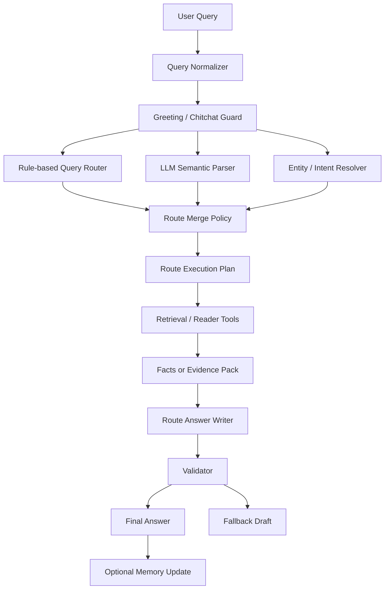

# 답변 라우팅 비전/설계

Status: canonical route contract. `basic_lookup` is implemented for supported
structured QA; `summary`, `analysis`, and `research` remain future writer
routes until v0.9+ work lands.

이 문서는 자연어 질문을 `basic_lookup`, `summary`, `analysis`, `research` 네 가지 답변 라우트로 분기하고, 각 라우트에서 검색엔진과 AI가 어떤 역할을 맡는지 구체적으로 정의한다.

목표는 단순한 검색 결과 요약기가 아니라, 질문 난이도와 위험도에 따라 검색 깊이, Evidence Pack 구조, AI 권한, validator를 다르게 적용하는 답변 엔진을 만드는 것이다.

## 1. 핵심 원칙

```text
검색엔진은 사실과 출처를 고정한다.
AI는 라우트별로 허용된 범위 안에서만 문장화, 요약, 해석, 탐색 계획을 수행한다.
질문 이해는 규칙 기반 라우터와 LLM 의미 파서를 동시에 사용하되, 최종 결정은 병합 정책과 validator가 통제한다.
```

라우트별 핵심 원칙은 다음과 같다.

```text
basic_lookup:
정답은 DB/규칙/템플릿이 결정한다. AI는 말투만 다듬는다.

summary:
문서 범위는 엔진이 결정한다. AI는 범위 안의 내용을 압축한다.

analysis:
검색엔진이 근거 묶음을 만든다. AI는 근거 계층을 분리해 해석한다.

research:
AI가 탐색 계획과 가설을 제안한다. 검색엔진과 Source Reader가 공식 원문 근거를 고정한다.
```

최종 답변은 모든 라우트에서 다음 출처 계층을 유지해야 한다.

```text
L0: 공식 원문 DB
L1: 공식 텍스트에서 자동 추출한 관계
L2: AI 연구 메모리 / 가설
L3: 위키 또는 정리 자료
L4: 커뮤니티 추측
L5: AI 자체 추론
```

현재 프로젝트의 우선순위는 L0, L1, L2까지다. L3, L4는 향후 외부 자료를 도입할 때 별도 라우트 또는 명시적 설정으로만 사용한다.

## 2. 전체 파이프라인



각 단계의 책임은 다음과 같다.

| 단계 | 책임 | AI 사용 여부 |
| --- | --- | --- |
| Query Normalizer | 공백, 언어, 따옴표, 약칭 정리 | 없음 |
| Greeting / Chitchat Guard | 인사말, 빈 질문, 일반 잡담을 검색 전에 차단 | 없음 |
| Rule-based Query Router | 키워드, exact lookup, 위험 신호 기반 1차 라우트 결정 | 없음 |
| LLM Semantic Parser | 자연어 의도, 요청 형식, 분석 깊이, 후속 질문 맥락 파악 | 보조 사용 |
| Entity / Intent Resolver | 엔티티 후보, 문서 후보, 의도 확정 | 제한적 가능 |
| Route Merge Policy | 규칙, 엔티티 resolve, LLM parse를 병합해 최종 RouteDecision 생성 | 없음 |
| Route Execution Plan | 어떤 도구를 어떤 순서로 호출할지 결정 | `research`에서만 적극 사용 |
| Retrieval / Reader Tools | 검색, 원문 읽기, 다국어 비교 | 없음 |
| Facts or Evidence Pack | 구조화된 사실 또는 근거 묶음 생성 | 없음 |
| Route Answer Writer | 템플릿, 요약, 해석, 보고서 작성 | 라우트별 허용 |
| Validator | 숫자, 이름, 주장, 출처 span 검증 | 보조 가능, 최종 판정은 규칙 |
| Optional Memory Update | 연구 메모리 추가/상태 변경 | `research` 중심 |

## 3. 라우트 요약

| Route | 질문 성격 | 대표 예시 | 검색 깊이 | AI 권한 | 최종 산출물 |
| --- | --- | --- | --- | --- | --- |
| `basic_lookup` | 정답이 DB 필드에 직접 있음 | `절연의 기치 효과`, `푸리나 특성 재료` | 낮음 | 문장 다듬기 | 구조화된 사실 답변 |
| `summary` | 특정 문서/스토리 범위 요약 | `수메르 마신임무 요약`, `일월 과거사 정리` | 중간 | 범위 내 압축 | 출처 기반 요약 |
| `analysis` | 관계, 의미, 근거 해석 | `천리와 셀레스티아 관계`, `운명의 베틀 의미` | 중간-높음 | 근거 기반 해석 | 근거 계층형 분석 |
| `research` | 가설 검증, 반례, 심층 탐색 | `페이몬 정체 공식 근거 중심`, `파네스=천리 가능성` | 높음 | 탐색 계획, 가설 비교 | 연구 보고서 |

## 4. 공통 데이터 계약

### 4.1 RouteDecision

라우터는 단순히 `mode`만 반환하지 않고, 실행 계획에 필요한 힌트를 같이 반환해야 한다.

```json
{
  "schema_version": "route_decision.v0.1",
  "query": "세계수와 기억 조작 연결 가능성",
  "mode": "research",
  "confidence": 0.88,
  "depth": 3,
  "signals": ["research:가능성", "research:연결"],
  "entities": [
    {
      "surface": "세계수",
      "canonical_id": "manual:irminsul",
      "confidence": 0.96
    }
  ],
  "intent": "hypothesis_investigation",
  "answer_contract": "research_report",
  "required_tools": [
    "search_text",
    "resolve_entities",
    "read_window",
    "find_counter_evidence",
    "build_evidence_pack"
  ],
  "risk_flags": ["speculation_possible"],
  "reason": "가능성, 연결 표현이 있고 정답이 DB 필드에 직접 존재하지 않는 연구형 질문입니다."
}
```

필드 의미:

| 필드 | 의미 |
| --- | --- |
| `mode` | `basic_lookup`, `summary`, `analysis`, `research` 중 하나 |
| `confidence` | 라우팅 신뢰도 |
| `depth` | 0에서 3까지의 검색 깊이 |
| `signals` | 분류에 사용된 키워드, 문맥, 설정 |
| `entities` | resolve된 엔티티 후보 |
| `intent` | 더 세부적인 의도 |
| `answer_contract` | 답변 생성기가 지켜야 할 출력 계약 |
| `required_tools` | 실행해야 할 도구 목록 |
| `risk_flags` | 추측, 스포일러, 불명확 엔티티 같은 위험 신호 |

### 4.2 ExecutionPlan

라우트 실행기는 다음 형태의 계획을 만든다.

```json
{
  "schema_version": "execution_plan.v0.1",
  "route": "analysis",
  "query": "운명의 베틀 의미",
  "steps": [
    {
      "id": "resolve_core_entities",
      "tool": "resolve_entities",
      "input": {"terms": ["운명의 베틀"]},
      "required": true
    },
    {
      "id": "search_direct_mentions",
      "tool": "search_text",
      "input": {"query": "운명의 베틀", "limit": 20},
      "required": true
    },
    {
      "id": "build_pack",
      "tool": "build_evidence_pack",
      "input": {"mode": "analysis"},
      "required": true
    }
  ],
  "budgets": {
    "max_searches": 6,
    "max_documents": 12,
    "max_text_units": 80,
    "max_llm_tokens": 1200
  }
}
```

### 4.3 AnswerPackage

모든 라우트의 최종 생성 전 산출물은 같은 외곽 구조를 가진다.

```json
{
  "schema_version": "answer_package.v0.1",
  "query": "파네스와 천리의 관계 가능성은?",
  "route": "research",
  "answer_contract": "research_report",
  "facts": [],
  "evidence": [],
  "claims": [],
  "limitations": [],
  "validation": {
    "status": "pending",
    "checks": []
  }
}
```

`basic_lookup`은 `facts` 중심이고, `summary`, `analysis`, `research`는 `evidence`와 `claims` 중심이다.

## 5. Route 1: basic_lookup

### 5.1 비전

`basic_lookup`은 정답이 로컬 DB 안에 직접 들어 있고, 답변 구조가 정형화 가능한 질문을 처리한다.

사용자가 기대하는 것은 추론이 아니라 정확한 조회다. 따라서 이 라우트의 품질은 LLM 성능이 아니라 정확한 엔티티 매칭, 필드 추출, 검증으로 결정된다.

### 5.2 대표 질문

```text
절연의 기치 효과 알려줘
푸리나 특성 재료 뭐야?
천공의 검 옵션 보여줘
나히다 돌파 재료
향릉 별자리 효과
이 무기 어디서 얻어?
```

### 5.3 라우팅 신호

긍정 신호:

```text
효과
옵션
스탯
재료
돌파
특성
세트
성유물
무기
캐릭터
레벨
어디서 얻
어떻게 얻
```

부정 신호:

```text
가능성
가설
정체
떡밥
반례
검증
상징
의미
관계
```

같은 질문에 긍정 신호와 부정 신호가 함께 있으면 `analysis` 또는 `research`로 승격한다.

예:

```text
절연의 기치 효과
→ basic_lookup

절연의 기치가 라이덴 서사와 어떤 관계야?
→ analysis

절연의 기치 설명이 셀레스티아 떡밥과 연결될 가능성 있어?
→ research
```

### 5.4 검색 전략

검색 우선순위:

```text
1. exact entity lookup
2. canonical_id 직접 조회
3. title_like 검색
4. entity_alias 검색
5. content_type 제한 FTS
6. TextMap 보조 검색
7. ambiguity response
```

content_type별 우선순위:

| 질문 신호 | 우선 content_type |
| --- | --- |
| 성유물, 세트 | `reliquary` |
| 무기, 옵션 | `weapon` |
| 캐릭터, 특성, 별자리 | `avatar` |
| 재료, 돌파 | `material`, `avatar`, `weapon` |
| 음식, 요리 | `food`, `material` |

### 5.5 처리 흐름

```text
User Query
→ route_query(mode=basic_lookup)
→ classify_lookup_intent
→ resolve_exact_entity
→ fetch_structured_fields
→ build_facts_json
→ template_answer
→ optional_llm_rewrite
→ validate_basic_lookup_answer
→ final answer
```

### 5.6 Facts JSON

예시:

```json
{
  "schema_version": "lookup_facts.v0.1",
  "intent": "artifact_effect_lookup",
  "entity": {
    "name": "절연의 기치",
    "canonical_id": "project_amber:reliquary:15020",
    "content_type": "reliquary"
  },
  "facts": {
    "two_piece": "원소 충전 효율 +20%",
    "four_piece": "원소 충전 효율의 25%만큼 원소폭발 피해가 증가한다.",
    "max_bonus": "최대 75%"
  },
  "source": {
    "source_level": "L0",
    "document_id": "project_amber:reliquary:15020",
    "field_paths": [
      "set_effects.2",
      "set_effects.4"
    ]
  },
  "confidence": 1.0
}
```

### 5.7 답변 계약

답변은 다음 조건을 지켜야 한다.

```text
1. 숫자와 고유명사를 바꾸지 않는다.
2. facts에 없는 효과, 조건, 획득처를 추가하지 않는다.
3. 추측 표현을 넣지 않는다.
4. 엔티티가 애매하면 답을 만들지 않고 후보를 제시한다.
5. 출처는 내부적으로 document_id와 field_path를 보존한다.
```

기본 답변 템플릿:

```text
{entity_name}은/는 {content_type_label}입니다.

{main_fact_lines}

출처: {source_title}
```

### 5.8 AI 사용 범위

허용:

```text
문장 자연스럽게 만들기
반복 줄이기
목록을 읽기 좋게 정리하기
존댓말/반말 톤 통일
```

금지:

```text
숫자 변경
조건 추가
설정 해석 추가
다른 캐릭터/아이템과의 관계 추론
공식 DB 밖 정보 추가
```

권장 프롬프트:

```text
아래 FACTS에 있는 정보만 사용하라.
숫자, 이름, 조건을 바꾸지 마라.
FACTS에 없는 설명을 추가하지 마라.
자연스러운 한국어로만 다듬어라.
```

### 5.9 Validator

필수 검사:

```text
allowed_numbers 검사
allowed_entities 검사
field_value substring 검사
금지 추측 표현 검사
lookup intent와 content_type 일치 검사
```

실패 시 fallback:

```text
LLM rewrite 폐기
템플릿 draft 반환
```

### 5.10 평가 기준

| 지표 | 목표 |
| --- | --- |
| exact_entity_accuracy | 0.95 이상 |
| field_accuracy | 0.98 이상 |
| hallucinated_number_rate | 0 |
| unsupported_claim_rate | 0 |
| ambiguity_detection_rate | 0.9 이상 |

## 6. Route 2: summary

### 6.1 비전

`summary`는 특정 문서, 퀘스트 체인, 책, 캐릭터 스토리, 지역 서사를 정해진 범위 안에서 요약한다.

핵심은 검색 hit 몇 개를 요약하는 것이 아니라, 사용자가 말한 범위를 정확히 확정한 뒤 그 범위 전체를 압축하는 것이다.

### 6.2 대표 질문

```text
수메르 마신임무 요약해줘
일월 과거사 내용 정리해줘
나히다 전설임무 줄거리 알려줘
민들레밭의 여우 무슨 내용이야?
폰타인 마신임무 핵심만 정리해줘
```

### 6.3 라우팅 신호

긍정 신호:

```text
요약
줄거리
내용 정리
정리해
무슨 내용
스토리 정리
핵심만
```

승격 조건:

```text
요약 요청 안에 가능성, 가설, 검증, 반례가 있으면 research로 승격한다.
요약 요청 안에 관계, 의미, 상징이 있으면 analysis로 승격한다.
```

예:

```text
일월 과거사 요약
→ summary

일월 과거사의 파네스 관련 의미 정리
→ analysis

일월 과거사를 바탕으로 파네스=천리 가설 검증
→ research
```

### 6.4 범위 확정 전략

`summary`의 첫 단계는 검색이 아니라 범위 확정이다.

범위 타입:

| Scope Type | 예시 | Resolver |
| --- | --- | --- |
| `single_document` | `일월 과거사` | book/document title resolver |
| `document_series` | `민들레밭의 여우` | book series resolver |
| `quest_chain` | `수메르 마신임무` | quest chain resolver |
| `character_story` | `나히다 캐릭터 스토리` | character story resolver |
| `region_arc` | `폰타인 마신임무` | region and archon quest resolver |
| `event_story` | 이벤트 스토리 | event resolver |

범위 확정 결과 예시:

```json
{
  "schema_version": "summary_scope.v0.1",
  "scope_type": "quest_chain",
  "title": "수메르 마신임무",
  "documents": [
    {
      "document_id": "project_amber:quest:1301",
      "title": "제3장 제1막",
      "order": 1
    },
    {
      "document_id": "project_amber:quest:1307",
      "title": "제3장 제5막",
      "order": 5
    }
  ],
  "confidence": 0.92,
  "ambiguities": []
}
```

### 6.5 처리 흐름

```text
User Query
→ route_query(mode=summary)
→ resolve_summary_scope
→ collect_ordered_text_units
→ segment_by_section_or_act
→ build_summary_evidence
→ generate_summary
→ validate_summary_coverage
→ final answer
```

### 6.6 검색 전략

검색 단계:

```text
1. 제목/별칭으로 문서 또는 시리즈 후보 탐색
2. canonical relation으로 같은 체인/시리즈 문서 확장
3. 언어별 제목 차이 보정
4. 문서 순서 복원
5. text_unit 또는 section 단위로 본문 수집
6. 너무 길면 섹션별 중간 요약 후 최종 요약
```

정렬 원칙:

```text
퀘스트: act/order/quest step 순서
책: volume/order 순서
캐릭터 스토리: story index 순서
아이템 스토리: lore text order 순서
```

### 6.7 Summary Evidence

```json
{
  "schema_version": "summary_evidence.v0.1",
  "scope": {
    "scope_type": "document_series",
    "title": "일월 과거사"
  },
  "units": [
    {
      "unit_id": "unit_001",
      "document_id": "project_amber:book:1036",
      "section_title": "제1권",
      "order": 1,
      "text": "...",
      "source_level": "L0"
    }
  ],
  "coverage": {
    "document_count": 4,
    "included_document_count": 4,
    "missing_documents": []
  }
}
```

### 6.8 답변 계약

답변 구조:

```text
짧은 한줄 요약
핵심 흐름
중요한 인물/개념
스토리상 의미
출처 범위
```

세부 옵션:

| 옵션 | 설명 | 기본값 |
| --- | --- | --- |
| `length` | `short`, `medium`, `long` | `medium` |
| `spoiler_level` | `none`, `light`, `full` | `full` |
| `style` | `timeline`, `paragraph`, `bullet` | `bullet` |
| `include_lore_terms` | 고유명사 설명 포함 여부 | true |

### 6.9 AI 사용 범위

허용:

```text
본문 압축
사건 순서 재구성
반복 대사 제거
핵심 인물과 사건을 묶어 설명
사용자 요청 길이에 맞게 축약
```

금지:

```text
범위 밖 사건 추가
추측을 공식 줄거리처럼 삽입
문서 순서 뒤집기
불확실한 관계 단정
요약 중 중요한 부정/조건 누락
```

### 6.10 Validator

필수 검사:

```text
scope 문서가 모두 포함되었는지
요약에 나온 고유명사가 source units 안에 있는지
숫자/장/막/권 번호가 원문 범위와 일치하는지
금지 추측 표현이 공식 요약처럼 쓰이지 않았는지
```

요약 누락 검사는 두 단계로 한다.

```text
1. structural coverage:
   문서, 섹션, 권, 막이 누락되지 않았는지 확인

2. claim coverage:
   요약의 핵심 주장마다 source unit이 붙는지 확인
```

### 6.11 평가 기준

| 지표 | 목표 |
| --- | --- |
| scope_resolution_accuracy | 0.9 이상 |
| ordered_document_accuracy | 0.95 이상 |
| summary_entity_grounding | 0.95 이상 |
| unsupported_summary_claim_rate | 0.03 이하 |
| missing_major_section_rate | 0.05 이하 |

## 7. Route 3: analysis

### 7.1 비전

`analysis`는 단순 조회나 요약보다 깊지만, 아직 장시간 탐색 루프가 필요하지 않은 질문을 처리한다.

핵심은 관련 공식 근거를 넓게 모으고, 근거를 계층화한 뒤, AI가 해석을 하되 공식 근거와 추측을 분리해서 답하게 하는 것이다.

### 7.2 대표 질문

```text
천리와 셀레스티아 관계가 뭐야?
운명의 베틀 의미가 뭐야?
파네스와 네 그림자 관련 근거 정리해줘
켄리아와 심연 교단은 어떻게 이어져?
세계수 기억 조작 관련 공식 근거 알려줘
```

### 7.3 라우팅 신호

긍정 신호:

```text
관련
관계
같은
동일
계승
상징
의미
근거
연관
비슷
대립
```

`research` 승격 신호:

```text
가능성
가설
추측
떡밥
검증
반례
정체
깊게
심층
```

예:

```text
천리와 셀레스티아 관계
→ analysis

천리와 셀레스티아가 같은 체계라는 가설 검증
→ research
```

### 7.4 검색 전략

`analysis`는 현재 `investigate`의 발전형이다.

검색 단계:

```text
1. 핵심 엔티티 resolve
2. 다국어 alias 확장
3. 수동 개념 seed 확장
4. FTS unicode 검색
5. FTS trigram 검색
6. title_like 검색
7. entity_alias 검색
8. TextMap 보조 검색
9. content_type 가중치 적용
10. 중복 문서 제거
11. Evidence Pack 그룹화
```

Evidence Pack 그룹:

| 그룹 | 의미 |
| --- | --- |
| `direct_mentions` | 질문 엔티티가 직접 등장 |
| `expanded_concept_evidence` | alias 또는 수동 개념 seed로 연결 |
| `contextual_background` | 주변 세계관 배경 |
| `parallel_language_evidence` | 한중일영 표현 차이 |
| `relation_candidates` | 관계 후보로 볼 수 있는 근거 |
| `counter_candidates` | 해석을 약화할 수 있는 후보 |

### 7.5 처리 흐름

```text
User Query
→ route_query(mode=analysis)
→ resolve_entities_and_concepts
→ expand_query_terms
→ run_hybrid_search
→ rerank_by_content_type_and_concept_coverage
→ build_evidence_pack
→ answer_writer_analysis
→ validate_claim_sources
→ final answer
```

### 7.6 Claim 모델

`analysis` 답변은 주장 단위로 근거를 추적한다.

```json
{
  "schema_version": "claim.v0.1",
  "claim_id": "C-001",
  "text": "운명의 베틀은 켄리아와 심연 교단의 계획을 설명하는 핵심 개념으로 등장한다.",
  "claim_type": "direct_or_near_direct",
  "source_level": "L0",
  "evidence_ids": ["E-001", "E-002"],
  "confidence": 0.82,
  "qualifier": "공식 텍스트 기준으로 확인 가능"
}
```

claim_type:

```text
direct_fact
direct_or_near_direct
inferred_relation
symbolic_interpretation
weak_hypothesis
counterpoint
```

`analysis`에서는 `weak_hypothesis`를 쓸 수 있지만, 최종 결론처럼 표현하면 안 된다.

### 7.7 답변 계약

기본 답변 구조:

```text
짧은 결론
공식 원문에서 확인되는 내용
간접적으로 연결되는 내용
가능한 해석
약한 부분 / 아직 단정할 수 없는 부분
다음에 더 파볼 만한 질문
```

답변 규칙:

```text
1. 공식 근거와 해석을 같은 문단에 섞지 않는다.
2. 해석에는 "가능하다", "볼 수 있다", "아직 단정은 어렵다" 같은 qualifier를 붙인다.
3. 주요 주장마다 evidence_id 또는 source reference를 내부적으로 가진다.
4. 근거가 약하면 결론을 낮춘다.
5. 검색 결과가 부족하면 부족하다고 말한다.
```

### 7.8 AI 사용 범위

허용:

```text
근거 그룹 요약
관계 후보 정리
공식 근거와 해석 분리
약한 결론 제시
사용자 질문에 맞춘 설명 순서 구성
```

금지:

```text
근거 없는 동일성 단정
공식 용어가 아닌 개념을 공식 설정처럼 표현
반례 후보 무시
검색되지 않은 문서를 근거로 언급
L5 추론을 L0 사실처럼 말하기
```

### 7.9 Validator

필수 검사:

```text
모든 핵심 claim에 evidence_id가 있는지
claim_type과 문장 qualifier가 맞는지
source_level이 답변 표현과 충돌하지 않는지
공식 근거 문단에 L2/L5 추론이 섞이지 않았는지
counter_candidates가 있는데 최종 결론이 과도하게 단정적인지
```

예:

```text
claim_type = symbolic_interpretation
문장 = "공식적으로 동일 존재다"
→ validator 실패

claim_type = symbolic_interpretation
문장 = "상징적으로 같은 질서 계열로 해석할 여지는 있다"
→ validator 통과 가능
```

### 7.10 평가 기준

| 지표 | 목표 |
| --- | --- |
| evidence_recall_at_k | 0.75 이상 |
| concept_coverage | 0.8 이상 |
| claim_grounding_rate | 0.95 이상 |
| unsupported_interpretation_rate | 0.05 이하 |
| overclaim_rate | 0.03 이하 |

## 8. Route 4: research

### 8.1 비전

`research`는 정답이 DB에 직접 들어 있지 않고, 여러 공식 근거를 읽고 비교해야 하는 질문을 처리한다.

이 라우트는 단발 검색이 아니라 탐색 루프다. AI는 탐색 방향, 가설, 반례 후보를 제안할 수 있지만, 모든 핵심 주장은 검색엔진과 Source Reader가 고정한 evidence span에 연결되어야 한다.

### 8.2 대표 질문

```text
페이몬의 정체를 공식 근거 중심으로 다시 봐줘
파네스와 천리의 주관자는 같은 존재일 가능성이 있어?
세계수와 기억 조작 떡밥이 천리와 연결될 수 있어?
니벨룽겐이 원초의 용왕과 관련 있다는 가설 검증해줘
운명의 베틀이 강림자 개념과 연결될 수 있는지 반례까지 봐줘
```

### 8.3 라우팅 신호

긍정 신호:

```text
깊게
심층
가설
가능성
추측
떡밥
연결
비교
검증
반례
세계관
정체
공식 근거 중심
다시 봐줘
```

자동 research 승격 조건:

```text
1. "가능성", "가설", "검증", "반례" 중 하나 이상 포함
2. 두 개 이상의 핵심 엔티티와 관계 질문이 결합됨
3. 사용자가 "공식 근거 중심", "깊게", "심층"을 요구함
4. 현재 워크스페이스가 research 모드이고 후속 질문으로 보임
```

### 8.4 Research Loop 구조

초기 구현은 독립 agent 여러 개가 아니라 하나의 `research_loop()` 안의 역할 함수로 시작한다.

```text
research_loop
  planner()
  retriever()
  reader()
  discovery()
  counter_search()
  synthesizer()
  validator()
```

각 역할:

| 역할 | 책임 | AI 사용 |
| --- | --- | --- |
| `planner` | 질문을 하위 조사 항목과 가설 후보로 분해 | 적극 사용 |
| `retriever` | 검색엔진 도구 호출 계획 실행 | 없음 또는 제한 |
| `reader` | 검색 hit 주변 문맥 확장 | 없음 |
| `discovery` | 새 연결 후보와 탐색 방향 제안 | 적극 사용 |
| `counter_search` | 반례, 약점, 대안 가설 탐색 | 적극 사용 |
| `synthesizer` | 가설별 근거/약점 보고서 작성 | 적극 사용 |
| `validator` | 주장별 evidence span 연결 확인 | 규칙 중심 |

### 8.5 처리 흐름

```text
User Query
→ route_query(mode=research)
→ initial_entity_resolution
→ planner creates research questions
→ retriever runs first-pass searches
→ reader expands context windows
→ discovery proposes related concepts
→ retriever searches discovered concepts
→ counter_search looks for weak points
→ evidence pins are created
→ synthesizer builds hypothesis report
→ validator checks claim grounding
→ final answer
→ optional research memory patch
```

### 8.6 ResearchPlan

```json
{
  "schema_version": "research_plan.v0.1",
  "query": "파네스와 천리의 주관자는 같은 존재일 가능성이 있어?",
  "research_goal": "파네스와 천리의 주관자 동일성 또는 계승 관계 가능성 검토",
  "hypotheses": [
    {
      "hypothesis_id": "H-001",
      "label": "동일 존재설",
      "initial_status": "open"
    },
    {
      "hypothesis_id": "H-002",
      "label": "계승 체계설",
      "initial_status": "open"
    },
    {
      "hypothesis_id": "H-003",
      "label": "같은 질서 계열의 별개 존재설",
      "initial_status": "open"
    }
  ],
  "questions": [
    {
      "id": "Q-001",
      "text": "파네스가 등장하는 공식 텍스트는 무엇인가?",
      "target": "direct_mentions"
    },
    {
      "id": "Q-002",
      "text": "천리의 주관자와 천리 체계가 직접 언급되는 문맥은 무엇인가?",
      "target": "direct_mentions"
    },
    {
      "id": "Q-003",
      "text": "두 개념을 직접 연결하거나 약화하는 텍스트가 있는가?",
      "target": "relation_or_counter"
    }
  ],
  "budgets": {
    "max_iterations": 3,
    "max_searches": 12,
    "max_windows": 20,
    "max_pinned_evidence": 40
  }
}
```

### 8.7 Source Reader

`research`에서는 검색 hit 한 줄만으로는 부족하다. 반드시 원문 읽기 도구가 필요하다.

도구 계약:

```python
find_exact(query, filters=None, limit=20)
read_unit(unit_id)
read_window(unit_id, before=5, after=5)
expand_window(window_id, direction="after", amount=10)
read_section(section_id)
read_document(document_id)
read_neighbor_document(document_id, direction)
read_parallel(unit_id, langs=["ko", "en", "ja", "zh"])
pin_evidence(document_id, start_char, end_char, role, source_level, note)
```

Reading Window 예시:

```json
{
  "window_id": "W-001",
  "document_id": "project_amber:quest:1307",
  "document_title": "수메르 마신임무",
  "section_id": "sec_12",
  "center_unit": "unit_1042",
  "before": ["..."],
  "center": "...",
  "after": ["..."],
  "next_actions": [
    "expand_before",
    "expand_after",
    "read_section",
    "read_parallel"
  ]
}
```

### 8.8 Evidence Pin

연구형 답변은 evidence span을 고정해야 한다.

```json
{
  "evidence_id": "E-014",
  "document_id": "project_amber:book:1036",
  "unit_id": "unit_8821",
  "start_char": 120,
  "end_char": 268,
  "role": "supports",
  "source_level": "L0",
  "hypothesis_ids": ["H-002"],
  "note": "창세 체계와 질서 계열 해석에 사용 가능한 문맥"
}
```

role:

```text
supports
weakly_supports
context
counter
ambiguous
translation_note
```

### 8.9 Hypothesis State

연구형 답변은 하나의 결론으로 바로 수렴하지 않는다. 가설별 상태를 둔다.

```json
{
  "hypothesis_id": "H-002",
  "label": "파네스 체계에서 천리 체계로 이어진 계승설",
  "status": "plausible_but_unproven",
  "supporting_evidence": ["E-014", "E-018"],
  "counter_evidence": ["E-022"],
  "confidence": 0.46,
  "why_not_higher": "직접 연결 문구가 없고, 상징/체계 유사성 중심입니다."
}
```

status 후보:

```text
open
plausible_but_unproven
weak
contradicted
unsupported
needs_more_evidence
```

### 8.10 답변 계약

기본 답변 구조:

```text
조사 결론 요약
검토한 가설
가설별 지지 근거
가설별 약점 / 반례
공식 원문에서 확실한 것
AI 해석 또는 추론인 것
현재 신뢰도
다음 조사 방향
```

문장 규칙:

```text
1. "공식적으로 확정"과 "가능성"을 분리한다.
2. 직접 근거 없는 동일성 주장은 금지한다.
3. 반례 후보를 최소 1회 이상 검토한다.
4. evidence가 부족한 가설은 낮은 신뢰도로 유지한다.
5. 발견된 새 연결 후보는 "후보" 상태로만 제시한다.
```

### 8.11 AI 사용 범위

허용:

```text
연구 질문 분해
가설 후보 생성
검색 키워드 제안
관련 개념 후보 제안
반례 탐색 방향 제안
가설별 보고서 작성
```

금지:

```text
검색하지 않은 근거를 인용
evidence span 없는 핵심 주장 생성
AI 가설을 공식 사실로 격상
사용자 선호에 맞춰 반례 무시
반박된 연구 메모리를 공식 근거처럼 재사용
```

### 8.12 Validator

필수 검사:

```text
모든 핵심 claim에 evidence_id가 있는지
각 evidence_id가 실제 document_id/unit_id/span을 가지는지
가설 상태와 결론 톤이 맞는지
counter evidence가 검토되었는지
L2/L5 추론이 L0 문단에 섞이지 않았는지
memory에서 온 내용이 source_level=L2로 표시되는지
```

실패 시 fallback:

```text
1. 과도한 결론 문장 제거
2. claim을 "검토 후보"로 낮춤
3. evidence가 부족하다는 제한사항 추가
4. 그래도 실패하면 Evidence Pack 요약만 반환
```

### 8.13 평가 기준

| 지표 | 목표 |
| --- | --- |
| research_claim_grounding_rate | 0.98 이상 |
| counter_evidence_attempt_rate | 0.9 이상 |
| hypothesis_separation_accuracy | 0.9 이상 |
| source_level_confusion_rate | 0.02 이하 |
| unsupported_major_claim_rate | 0.02 이하 |
| useful_next_question_rate | 0.8 이상 |

## 9. 라우터 구현 설계

### 9.1 초기 구현

초기 라우터는 현재처럼 휴리스틱 기반으로 유지한다.

```text
basic_lookup:
게임 정보 키워드가 있고 연구/관계 신호가 없을 때

summary:
요약 키워드가 있고 연구 신호가 없을 때

research:
가설/가능성/검증/반례/정체/심층 신호가 있을 때

analysis:
관계/의미/근거 신호가 있거나 기본 fallback일 때
```

### 9.2 규칙 라우터와 LLM 의미 파서 동시 사용

다음 단계에서는 규칙 기반 라우터를 LLM으로 대체하지 않고, 별도의 LLM semantic parser를 병렬로 호출한다.

목표:

```text
규칙 라우터:
빠르고 재현 가능한 route 후보, exact lookup, 위험 신호, guard 처리

LLM semantic parser:
자연어 의도, 숨은 요청 형식, 질문 깊이, 후속 질문 맥락, 모호한 표현 해석

병합 정책:
두 결과를 비교해 최종 RouteDecision을 만들고, 충돌 시 deterministic 신호와 안전 규칙을 우선한다.
```

처리 순서:

```text
1. query_normalize
2. greeting_or_chitchat_guard
3. exact_entity_lookup
4. rule_based_route
5. llm_semantic_parse
6. merge_route_decision
7. route 실행
```

LLM semantic parser 출력 계약:

```json
{
  "schema_version": "semantic_parse.v0.1",
  "route": "basic_lookup",
  "intent": "character_basic_info",
  "entities": [
    {
      "surface": "아야카",
      "content_type_hint": "avatar",
      "confidence": 0.88
    }
  ],
  "requested_format": "paragraph",
  "depth": 0,
  "is_greeting": false,
  "is_followup": false,
  "needs_official_sources": true,
  "risk_flags": [],
  "confidence": 0.86,
  "reason": "단일 캐릭터에 대한 자연어 기본 정보 요청입니다."
}
```

허용되는 `requested_format`:

```text
paragraph
bullet
table
short
long
```

병합 우선순위:

```text
1. 인사말/잡담 guard가 참이면 검색과 LLM 라우팅 결과를 사용하지 않는다.
2. exact entity lookup이 높은 신뢰도로 성공하면 엔티티는 규칙 결과를 우선한다.
3. LLM이 DB에 없는 엔티티를 새로 만들면 폐기한다.
4. research/analysis 승격 신호는 규칙과 LLM 중 하나라도 강하게 감지하면 보수적으로 승격할 수 있다.
5. basic_lookup 신호가 강하고 연구/관계 신호가 없으면 단일 엔티티 질문은 basic_lookup을 우선한다.
6. requested_format은 LLM 결과를 사용할 수 있지만, 사용자 명시 표현이 있으면 규칙 결과를 우선한다.
7. LLM parse 실패, timeout, JSON 파싱 실패 시 기존 규칙 라우터 결과만 사용한다.
```

예:

```text
아야카
규칙: 단일 캐릭터 exact hit
LLM: character_basic_info
최종: basic_lookup / character_basic_info / paragraph

아야카에 대해서 알려줘
규칙: 캐릭터명 + 알려줘
LLM: character_basic_info
최종: basic_lookup / character_basic_info / paragraph

세계수 기억 조작 떡밥 다시 봐줘
규칙: 떡밥, 다시 봐줘
LLM: research_or_analysis
최종: research 또는 analysis

안녕
guard: greeting
최종: 검색 실행 안 함
```

### 9.3 다음 단계 라우터

휴리스틱 이후에는 `RouteDecision` 생성을 다음처럼 확장한다.

```text
1. keyword signal score
2. entity count score
3. content_type likelihood
4. workspace current mode
5. user default depth
6. ambiguity score
7. LLM semantic parser result
8. merge policy confidence
```

라우트 점수 예시:

```json
{
  "scores": {
    "basic_lookup": 0.08,
    "summary": 0.04,
    "analysis": 0.34,
    "research": 0.88
  },
  "selected": "research",
  "reason": "가설 검증 표현과 두 핵심 엔티티 관계 질문이 결합되었습니다."
}
```

### 9.4 모호성 처리

모호한 경우에는 질문하지 않고 낮은 비용 라우트에서 시작하되, 부족하면 승격한다.

```text
analysis 실행
→ 직접 근거 부족
→ relation/counter 필요 감지
→ research 제안 또는 자동 승격
```

다만 `basic_lookup`에서 엔티티가 여러 개로 갈라지는 경우에는 후보를 제시해야 한다.

```text
"천공 효과 알려줘"
→ 천공의 검, 천공의 날개, 천공의 두루마리 후보 제시
```

## 10. 도구 설계

### 10.1 공통 검색 도구

```python
exact_lookup(entity_name: str, content_type: str | None = None) -> LookupResult
resolve_entities(query: str, limit: int = 10) -> list[ResolvedEntity]
search_text(query: str, filters: dict | None = None, limit: int = 20) -> list[SearchHit]
search_by_alias(alias: str, langs: list[str] | None = None) -> list[SearchHit]
search_textmap(query: str, langs: list[str] = ["ko", "en", "ja", "zh"]) -> list[SearchHit]
build_evidence_pack(query: str, hits: list[SearchHit], mode: str) -> EvidencePack
```

### 10.1.1 v0.8.2/v0.8.3 Meaning-First Routing Alignment

Before v0.9 writer work, routing is realigned around DB-Grounded Query
Understanding. The design target is documented in
`docs/DB_GROUNDED_QUERY_UNDERSTANDING.md`.

Current implementation status:

- `basic_lookup` is implemented only for supported structured QA targets.
- `search` and `investigate` are the current source-readable lore exploration
  paths.
- `summary`, `analysis`, and `research` writers are future-route work and must
  not be described as implemented final answer generators.

Implemented policy:

1. Build a Candidate Meaning Pack from DB-backed candidates before final route
   selection.
2. Keep supported exact lookup strict.
3. Treat lore concepts as `lore_concept` candidates unless there is a strong
   supported-entity match.
4. Classify candidates as strong, weak, or unsafe.
5. Do not allow weak partial overlap to promote a lore concept into
   avatar/weapon/reliquary `basic_lookup`.
6. Use previous conversation context only for genuinely low-information
   follow-ups.
7. Reject stale `last_entity` context when the user asks an explicit new topic.
8. Use the LLM as a semantic adjudicator over DB candidates, not as final fact
   authority.
9. Validate LLM-selected meanings through deterministic DB/entity resolution and
   source-readable Source Reader/Evidence handles.

Speed is not the primary optimization target for this layer. A slow
conservative route that returns search/investigate handles is better than a fast
wrong `basic_lookup` answer.

### 10.2 summary 전용 도구

```python
resolve_summary_scope(query: str) -> SummaryScope
read_document_ordered(document_id: str) -> list[TextUnit]
read_series_ordered(series_id: str) -> list[TextUnit]
read_quest_chain(quest_chain_id: str) -> list[TextUnit]
```

### 10.3 analysis/research 도구

```python
find_similar_passages(unit_id: str, limit: int = 10) -> list[SearchHit]
find_translation_diffs(unit_id: str) -> list[TranslationDiff]
find_counter_evidence(claim: str, entities: list[str]) -> list[SearchHit]
search_motifs(seed: str, limit: int = 20) -> list[MotifHit]
get_graph_paths(source_entity: str, target_entity: str, max_hops: int = 3) -> list[GraphPath]
```

초기에는 `find_similar_passages`, `search_motifs`, `get_graph_paths`가 stub이어도 된다. 중요한 것은 `ExecutionPlan`과 `AnswerPackage`가 나중 도구 추가를 수용할 수 있는 구조를 갖는 것이다.

## 11. LLM 사용 정책

라우팅 전 단계의 LLM은 답변을 생성하지 않는다. semantic parser는 짧은 JSON만 반환하며, temperature는 0에 가깝게 두고 timeout과 fallback을 반드시 둔다.

| 단계/Route | LLM 역할 | temperature | 실패 시 |
| --- | --- | --- | --- |
| `semantic_parse` | 자연어 의도와 요청 형식 JSON 추출 | 0-0.1 | 규칙 라우터만 사용 |
| `basic_lookup` | 템플릿 문장 다듬기 | 0.1-0.2 | 템플릿 반환 |
| `summary` | 범위 내 요약 | 0.2-0.3 | 구조 요약 반환 |
| `analysis` | 근거 기반 해석 | 0.2-0.35 | Evidence Pack 요약 반환 |
| `research` | 계획, 가설, 보고서 | 0.25-0.45 | evidence 중심 중간 보고 반환 |

공통 금지:

```text
출처 없는 공식 단정
검색 결과에 없는 고유명사 추가
숫자/조건 변경
source_level 변조
반례 누락
```

## 12. Validator 매트릭스

| 검사 | basic_lookup | summary | analysis | research |
| --- | --- | --- | --- | --- |
| 숫자 검사 | 필수 | 필요시 | 필요시 | 필요시 |
| 고유명사 검사 | 필수 | 필수 | 필수 | 필수 |
| field value 검사 | 필수 | 선택 | 선택 | 선택 |
| scope coverage | 없음 | 필수 | 선택 | 선택 |
| claim evidence 연결 | 선택 | 필수 | 필수 | 필수 |
| source_level 표현 검사 | 선택 | 필수 | 필수 | 필수 |
| 반례 검토 | 없음 | 없음 | 선택 | 필수 |
| hypothesis state 검사 | 없음 | 없음 | 선택 | 필수 |
| memory contamination 검사 | 없음 | 없음 | 선택 | 필수 |

## 13. 구현 배치 제안

새 코드는 검색엔진과 분리된 답변 엔진 계층으로 둔다.

```text
src/genshin_lore_db/answer_engine/
  __init__.py
  router_contracts.py
  planner.py
  lookup.py
  summary.py
  analysis.py
  research.py
  prompts.py
  validators.py
  schemas.py
  writers.py
```

역할:

| 파일 | 책임 |
| --- | --- |
| `router_contracts.py` | `RouteDecision`, `ExecutionPlan` 모델 |
| `lookup.py` | `basic_lookup` 실행 |
| `summary.py` | `summary` scope resolver와 요약 실행 |
| `analysis.py` | Evidence Pack 기반 분석 실행 |
| `research.py` | research loop v1 |
| `prompts.py` | 라우트별 LLM 프롬프트 |
| `validators.py` | 공통/라우트별 검증 |
| `writers.py` | 템플릿과 LLM writer |

CLI는 기존 `lore_search_engine.py`와 분리한다.

```text
scripts/lore_answer_engine.py route "..."
scripts/lore_answer_engine.py answer "..."
scripts/lore_answer_engine.py answer "절연의 기치 효과" --route basic_lookup
scripts/lore_answer_engine.py answer "세계수와 기억 조작 연결 가능성" --route research
```

## 14. 단계별 구현 순서

### Phase A: 공통 계약

```text
1. RouteDecision 확장
2. ExecutionPlan 모델 추가
3. AnswerPackage 모델 추가
4. 공통 validator scaffold 추가
5. 라우트별 fixture 작성
```

완료 기준:

```text
라우터가 mode뿐 아니라 answer_contract, required_tools, risk_flags를 반환한다.
```

### Phase B: basic_lookup

```text
1. lookup intent 분류
2. exact entity resolver
3. facts JSON 생성
4. 템플릿 답변 생성
5. 숫자/이름 validator
```

완료 기준:

```text
성유물/무기/캐릭터 기본 질문을 LLM 없이 안정적으로 답한다.
```

### Phase C: summary

```text
1. summary scope resolver
2. 문서/시리즈/퀘스트 체인 순서 복원
3. ordered text unit 수집
4. 섹션별 요약
5. coverage validator
```

완료 기준:

```text
책 한 권, 책 시리즈, 마신임무 범위를 구분해 요약한다.
```

### Phase D: analysis

```text
1. 기존 investigate Evidence Pack 재사용
2. claim 모델 추가
3. analysis writer 추가
4. source_level과 qualifier validator 추가
5. analysis 평가셋 작성
```

완료 기준:

```text
공식 근거, 간접 연결, 가능한 해석, 약점을 분리해 답한다.
```

### Phase E: Source Reader

```text
1. read_unit
2. read_window
3. expand_window
4. read_section
5. pin_evidence
```

완료 기준:

```text
검색 hit 주변 문맥을 확장하고 evidence span을 고정한다.
```

### Phase F: research loop v1

```text
1. planner
2. retriever
3. reader
4. counter_search
5. synthesizer
6. research validator
```

완료 기준:

```text
하나의 질문에서 최소 2개 가설을 만들고, 각 가설의 지지 근거와 약점을 분리한다.
```

### Phase G: Memory

```text
1. research_notes
2. research_evidence
3. hypothesis state
4. memory patch
5. contamination guard
```

완료 기준:

```text
이전 연구를 참고하되, AI 가설을 공식 사실처럼 재사용하지 않는다.
```

## 15. 평가셋 설계

라우트별 평가셋을 분리한다.

```text
config/eval_basic_lookup.json
config/eval_summary.json
config/eval_analysis.json
config/eval_research.json
```

공통 케이스 구조:

```json
{
  "id": "artifact_emblem_lookup",
  "query": "절연의 기치 효과",
  "expected_route": "basic_lookup",
  "expected_entities": ["project_amber:reliquary:15020"],
  "expected_answer_contract": "structured_fact_answer",
  "must_include": ["원소 충전 효율 +20%", "최대 75%"],
  "must_not_include": ["추측", "라이덴"]
}
```

research 평가셋은 정답 하나를 요구하지 않는다.

```json
{
  "id": "phanes_heavenly_principles_research",
  "query": "파네스와 천리의 주관자는 같은 존재일 가능성이 있어?",
  "expected_route": "research",
  "expected_hypotheses_min": 2,
  "must_have_counter_evidence_attempt": true,
  "must_separate_source_levels": true,
  "forbidden_claims": [
    "공식적으로 파네스와 천리는 동일 존재로 확정됐다"
  ]
}
```

## 16. 실패 처리 정책

| 실패 상황 | 처리 |
| --- | --- |
| 엔티티 후보가 여러 개 | 후보 목록 제시, 답변 생성 중단 |
| exact lookup 실패 | `analysis` 검색으로 fallback하거나 재질문 |
| summary scope 불명확 | 가능한 범위 후보 제시 |
| Evidence Pack 품질 낮음 | 낮은 신뢰도 명시 |
| LLM rewrite validator 실패 | 템플릿 또는 evidence 요약 반환 |
| research budget 초과 | 중간 보고서와 다음 조사 방향 반환 |
| counter evidence 검색 실패 | 실패 사실을 limitations에 기록 |

## 17. 사용자 경험 기준

응답 속도 목표:

| Route | 목표 |
| --- | --- |
| `basic_lookup` | 즉시 또는 1초 내 |
| `summary` | 짧은 문서는 3초 내, 긴 체인은 스트리밍 |
| `analysis` | 5-15초 |
| `research` | 스트리밍 또는 job 방식 |

스트리밍이 필요한 경우:

```text
research plan 생성됨
1차 근거 검색 중
문맥 확장 중
반례 후보 검색 중
가설별 보고서 작성 중
```

`research`는 최종적으로 비동기 job도 지원할 수 있다.

```text
/research 요청
→ job_id 반환
→ 진행 상황 스트리밍
→ 완료 시 research report 저장
```

## 18. 최종 목표

네 라우트는 서로 다른 제품 경험을 제공한다.

```text
basic_lookup:
빠르고 정확한 공식 DB 조회기

summary:
긴 원문을 범위 손실 없이 압축하는 스토리 정리기

analysis:
공식 근거와 해석을 분리하는 세계관 분석기

research:
여러 가설을 근거와 반례로 비교하는 스토리 연구 에이전트
```

이 구조가 완성되면 사용자는 같은 채팅창에서 짧은 게임 정보 조회부터 깊은 세계관 연구까지 이어갈 수 있고, 시스템은 질문 수준에 맞춰 검색 비용과 AI 권한을 자동으로 조절할 수 있다.
