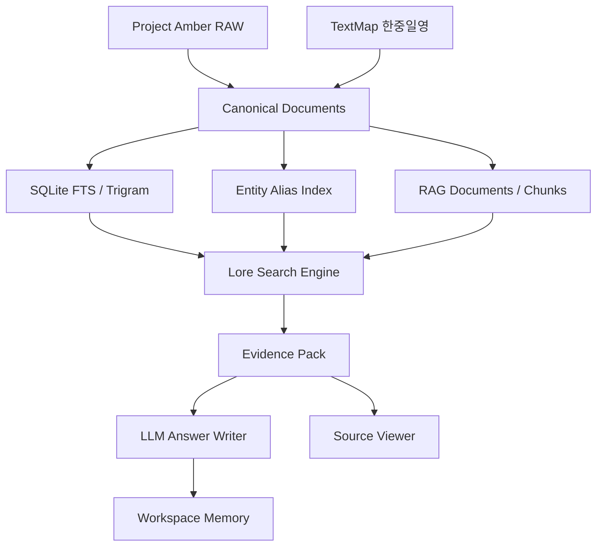

# 시스템 아키텍처

Status: canonical current architecture.

현재 프로젝트는 웹 서비스가 아니라 개발자용 데이터/검색 코어입니다. 전체 목표 아키텍처는 아래와 같습니다.

## v0.8.3 Query Understanding

The current architecture is a developer-facing retrieval core, not a finished
research assistant product. v0.8 has Source Reader and Evidence Pin workflows;
v0.8.1 hardened current QA/search behavior; v0.8.2 aligned documentation; and
v0.8.3 adds DB-Grounded Query Understanding / Meaning Search.

Before v0.9 writer work, routing now uses meaning-first diagnostics before
structured QA execution:

```text
query
-> hard guards
-> DB-backed candidate gathering
-> Candidate Meaning Pack
-> LLM semantic adjudication over candidates
-> deterministic DB/entity and source-readable validation
-> route decision
```

The LLM is a semantic adjudicator, not the final fact authority. Summary,
analysis, and research writers remain future work until implemented and
validated.



## 계층

```text
Data Layer
- RAW 수집 데이터
- Project Amber 전처리 데이터
- canonical documents/chunks/entity_names/source_links
- TextMap entries

Index Layer
- SQLite FTS5 unicode 검색
- SQLite FTS5 trigram 검색
- 엔티티/별칭 인덱스
- 중복/병렬 문서 그룹

Search Layer
- Query Router
- Query Expansion
- FTS Search
- Title-like Search
- Entity Alias Search
- TextMap 보조 검색
- Reranking

Reasoning Layer
- Evidence Pack
- 반례 후보 그룹
- LLM 프롬프트 패키지

Future Layer
- Vector Search
- Motif Index
- Graph Search
- Translation Diff Index
- Workspace Memory
- Web/API UI
```

## 현재 구현 상태

| 영역 | 상태 | 설명 |
| --- | --- | --- |
| Project Amber 수집 | 구현 | 기본/상세/보강 수집 스크립트 존재 |
| TextMap 수집 | 구현 | 한중일영 TextMap 수집 |
| RAW 보존 | 구현 | 원문 JSON은 별도 보존 |
| 사람이 읽는 전처리 | 구현 | 제목 기반 파일명으로 Project Amber 복사본 생성 |
| canonical 빌드 | 구현 | documents, chunks, entity_names, source_links 생성 |
| RAG 자산 | 구현 | 문서/청크/중복/병렬 그룹 생성 |
| SQLite 검색 DB | 구현 | chunks/textmap FTS unicode/trigram |
| 엔티티 별칭 DB | 구현 | 자동 별칭 + 수동 개념 seed |
| 개발자 CLI | 구현 | `route`, `search`, `investigate`, `eval_search_engine` |
| Query Router | 기본 구현 | `basic_lookup`, `summary`, `analysis`, `research` 휴리스틱 분류 |
| DB-Grounded Query Understanding | 구현 | Candidate Meaning Pack, strong/weak/unsafe matching, LLM adjudication with DB/source validation |
| Evidence Pack | 기본 구현 | `evidence_pack.v0.5` 스키마와 source/group/quality 구조 |
| Project Amber v2 파이프라인 | 구현 | `pipeline/project_amber_v2.py`에서 readable/canonical/search v2 병행 생성 |
| 검색 평가셋 | 구현 | 6개 대표 질의 기준 Recall/MRR/Route 평가 |
| LLM 연결 | 부분 구현 | 로컬 Ollama Qwen3 rewriter/semantic parser와 fallback은 구현됨. writer용 runtime/profile 계약은 v0.8.5/v0.8.6 대상 |
| 벡터 검색 | 미구현 | 인터페이스만 준비 |
| 모티프 인덱스 | 미구현 | 다음 단계 후보 |
| 그래프 검색 | 미구현 | Discovery Index 이후 구현 |
| API/프론트엔드 | 미구현 | 개발자 코어 이후 작업 |

## 향후 목표 구조

최종적으로는 검색엔진을 AI가 호출하는 도구로 제공합니다.

```text
exact_lookup
search_text
search_vector
resolve_entities
search_motifs
get_graph_paths
find_similar_passages
find_translation_diffs
find_counter_evidence
build_evidence_pack
```

LLM은 DB를 직접 뒤지는 주체가 아니라, 이 도구들이 만든 Evidence Pack을 해석하고 비교하는 역할을 맡습니다.

## 설계 원칙

- 검색엔진이 본체이고 LLM은 교체 가능한 해석기입니다.
- RAW 데이터와 전처리/인덱스 산출물을 분리합니다.
- 다국어 표현은 같은 개념으로 묶되 원문 차이를 잃지 않습니다.
- 검색 결과는 답변용 문장보다 먼저 출처 추적 가능한 Evidence Pack으로 정리합니다.
- 연구용 추측은 공식 근거와 섞지 않습니다.
